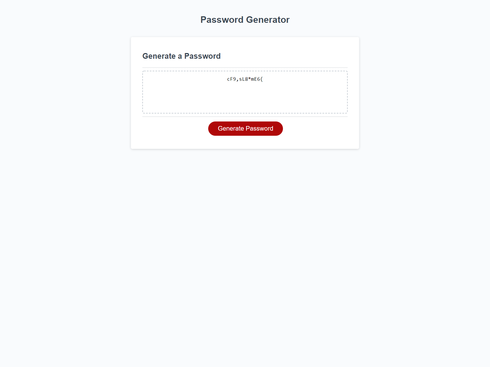

# password-generator

# Table of Contents

1. [Description](#description)
2. [Visuals](#visuals)
3. [Resources](#resources)

## Description

this assignment was to make a randomly generated password in java script. this was to have a better understanding on how to set up functions and alerts. 

## Visuals

## Resources
- [Live Site](https://mortalmx13.github.io/portfolio/)

- [Respository](https://github.com/Mortalmx13/portfolio)